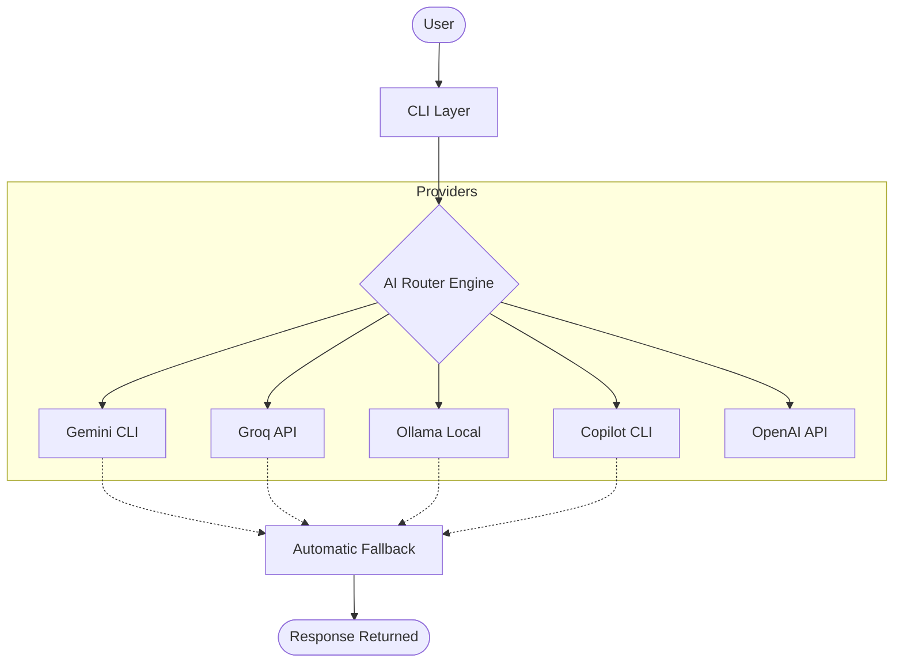

# 🚀 AI Router v1.1 — Multi-LLM Intelligent Routing System

A production-style **Multi-LLM routing engine** built in Node.js that dynamically selects and fails over between multiple AI providers (Gemini, Groq, Ollama, GitHub Copilot, OpenAI).

This project demonstrates how to build **resilient, cost-aware, provider-agnostic AI systems** with automatic failover, health checks, and unified credential management.

---

## 🧠 Problem Statement

Most AI applications today depend on a single LLM provider:

- ❌ API rate limits break applications
- ❌ Model downtime causes failures
- ❌ Cost is not optimized
- ❌ No fallback mechanism exists

This project solves these issues using a **routing-based AI architecture**.

---

## 🏗️ Architecture



---

## 🔥 Key Features

✔ **Multi-LLM Support:** Gemini, Groq, Ollama, GitHub Copilot, and OpenAI-ready.  
✔ **Automatic Fallback:** Intelligent retry and failover across providers in priority order.  
✔ **Health Check System:** Comprehensive diagnostic tool to verify provider status and credentials.  
✔ **Dynamic Model Detection:** Automatically discovers installed Ollama models.  
✔ **Centralized Credentials:** Secure and unified management of API keys and tokens via `.env`.  
✔ **Diagnostic Logging:** Persistent logs for tracking router decisions and provider performance.  

---

## 📦 Supported Providers

| Provider | Status | Role | Priority |
|----------|--------|------|----------|
| Gemini   | Active | Primary (High-quality reasoning) | 1 |
| Groq     | Active | Fast inference | 2 |
| Ollama   | Active | Local execution (Offline) | 3 |
| Copilot  | Active | Development & Coding | 4 |
| OpenAI   | Ready  | Optional / Future use | 5 |

---

## 💻 Installation

```bash
git clone https://github.com/vikas0486/ai-router.git
cd ai-router
npm install
```

### Configuration

Create a `.env` file in the root directory:

```env
GROQ_API_KEY=your_groq_key
GEMINI_API_KEY=your_gemini_key
GITHUB_TOKEN=your_github_token
OLLAMA_MODEL=deepseek-r1:8b # Optional: defaults to first available
```

---

## ▶️ Usage

### 1. Run a health check

Verify all providers are correctly configured and reachable:

```bash
node cli.js --health
```

### 2. Run a prompt

```bash
node cli.js "write a python factorial function"
```

### 3. Force a specific model

```bash
node cli.js --model ollama "What is the capital of France?"
```

### 4. 🎯 Interactive Chat Mode

Launch an interactive chat session with seamless multi-LLM routing:

```bash
node chat.js
```

**Features:**
- 💬 **Stateful Conversations** - Chat history is automatically saved
- 🔄 **Seamless Routing** - Switch between providers without friction
- 🎮 **Interactive Commands** - Use `/model`, `/history`, `/clear`, `/exit`
- 🎨 **Beautiful UI** - Color-coded output with loading spinners
- 💾 **Persistent Memory** - Last 50 messages survive restarts

**Example Session:**
```
[auto] You: What is machine learning?
Thinking...
✔ Response received

┌─ AI Response
│
│ Machine learning is a subset of artificial intelligence...
└

[auto] You: /model groq
✓ Model set to: groq

[groq] You: Explain neural networks
Thinking...
✔ Response received

┌─ AI Response
│
│ Neural networks are computational systems inspired by...
└

[groq] You: /history
[groq] You: /exit
Goodbye! 👋
```

For detailed documentation, see [CHAT_GUIDE.md](./CHAT_GUIDE.md) and [CHAT_ARCHITECTURE.md](./CHAT_ARCHITECTURE.md)

---

## 🧱 Project Structure

```
ai-router/
├── cli.js                  # CLI Entry point (single prompt)
├── chat.js                 # Interactive Chat CLI with session management
├── CHAT_GUIDE.md           # Chat user guide
├── CHAT_ARCHITECTURE.md    # Chat design documentation
├── CHAT_IMPLEMENTATION_SUMMARY.md  # Implementation notes
├── SETUP.md                # Development setup guide
├── config/
│   ├── credentials.js      # Credential loader & validator
│   └── models.json         # Model configurations
├── logs/                   # Diagnostic logs
├── memory/                 # Session memory & state
│   ├── memory.js           # Memory management
│   └── session.json        # Persisted session state
├── providers/              # LLM provider implementations
│   ├── gemini.js           # Google Gemini API
│   ├── groq.js             # Groq API (fast inference)
│   ├── ollama.js           # Ollama local execution
│   ├── copilot.js          # GitHub Copilot CLI
│   └── openai.js           # OpenAI API (ready)
├── router/                 # Core routing & failover logic
│   ├── engine.js           # Routing engine & automatic failover
│   ├── logger.js           # Diagnostic logger
│   ├── provider.registry.js # Provider registration system
│   └── providers.config.js  # Provider priority & settings
├── skills/                 # Skills & technique documentation
│   ├── memory.md           # Project memory & architecture
│   └── SKILL.md            # Skill reference & patterns
├── tests/                  # Test suite
├── package.json            # Dependencies
└── README.md               # This file
```

---

## 📄 License

MIT License — feel free to use and extend.

---

## ⭐ Author

Built as part of an AI Engineering learning journey focused on building **AI infrastructure, not just AI apps**.
